---
## Author
author:
  name: Чистов Даниил Максимович
  degrees: DSc
  orcid: 0000-0002-0877-7063
  email: 1132236021@rudn.ru
  affiliation:
    - name: Российский университет дружбы народов
      country: Российская Федерация
      postal-code: 117198
      city: Москва
      address: ул. Миклухо-Маклая, д. 6
### Title
title: Лабораторная работа №3
subtitle: Математическое моделирование
license: CC BY
date: today
date-format: "YYYY-MM-DD" # Example: 2025-09-06
---

## Докладчик

* Чистов Даниил Максимович
* Студент
* Третий курс
* Российский университет дружбы народов им. П. Лумумбы

## Цель работы

Целью данной работы является изучение модели боевых действий (Ланчестера) и попытка их реализации.

# Задание

## Задание

* Изучить модель боевых действий
* Реализовать задачу с решением по заданному варианту

## О модели боевых действий

В противоборстве могут принимать участие как регулярные войска, так и партизанские отряды. В общем случае главной характеристикой соперников являются численности сторон. Если в какой-то момент времени одна из численностей обращается в нуль, то данная сторона считается проигравшей (при условии, что численность другой стороны в данный момент положительна).

Существует три случая ведения боевых действий:

1. Боевые действия между регулярными войсками

2. Боевые действия с участием регулярных войск и партизанских отрядов

3. Боевые действия между партизанскими отрядами

## Первый случай

В первом случае численность регулярных войск определяется тремя
факторами:
* скорость уменьшения численности войск из-за причин, не связанных с боевыми действиями (болезни, травмы, дезертирство);
* скорость потерь, обусловленных боевыми действиями противоборствующих сторон (что связанно с качеством стратегии, уровнем вооружения, профессионализмом солдат и т.п.);
* скорость поступления подкрепления (задаётся некоторой функцией от времени)

## Второй случай

Во втором случае в борьбу добавляются партизанские отряды. Нерегулярные войска в отличии от постоянной армии менее уязвимы, так как действуют скрытно, в этом случае сопернику приходится действовать неизбирательно, по площадям, занимаемым партизанами. Поэтому считается, что тем потерь партизан, проводящих свои операции в разных местах на некоторой известной территории, пропорционален не только численности армейских соединений, но и численности самих партизан

## Постановка задачи

Между страной Х и страной У идет война. Численность состава войск исчисляется от начала войны, и являются временными функциями x t и y t. Для упрощения модели считаем, что коэффициенты, , ,a b c h постоянны. Также считаем( )P t и Q t непрерывные функции.

Требуется рассмотреть три модели боя:

- Модель боевых действий между регулярными войсками
- Модель ведение боевых действий с участием регулярных войск и партизанских отрядов
- Модель боевых действий между партизанскими отрядами

Проверьте, как работает модель в различных ситуациях, постройте графики y t и x t в рассматриваемых случаях. Определите победителя, найдите условие, при котором та или другая сторона выигрывают бой (для каждого случая

## Выполнение лабораторной работы

В папке lab03 инициализирую проект для данной лабораторной работы

{#fig-001 width=70%}

# Работа с моделью

## Базовая визуализация

Предварительно создаю файл daisyworld.jl в папке /src. Он будет использоваться последующими программами. Этот код и является моделью daisyworld.

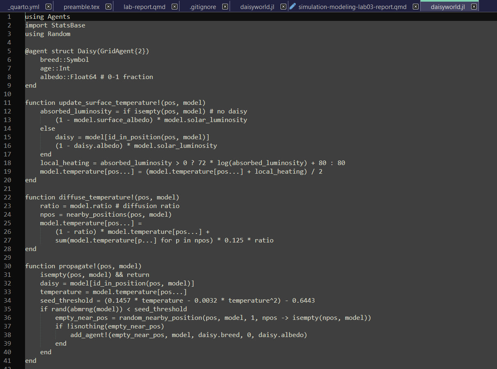{#fig-002 width=70%}

## Базовая визуализация

Создаю файл daisyworld.jl в папке /scripts, запускаю его. Код успешно работает.

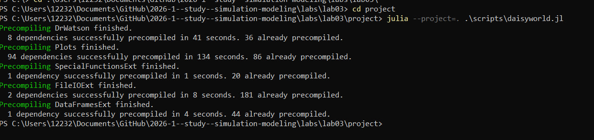{#fig-003 width=70%}

## Базовая визуализация

Создаю файл производные файла daisyworld.jl. Все файлы успешно созданы.

{#fig-004 width=70%}

## Базовая визуализация

Проверяю jupyter notebook daisyworld.jl. Файл успешно работает. Аналогичные шаги будут произведены с послеующими программами: преобразование в литературный стиль, генерация производных, проверка работы ([рис. @fig-005]).

{#fig-005 width=70%}

## Базовая визуализация

В результате работы программы были получены следующие графики: 

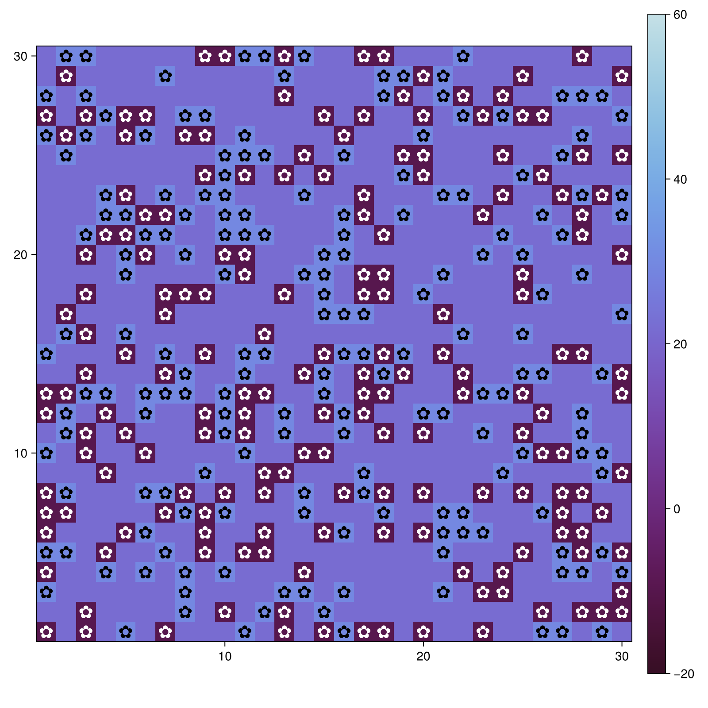{#fig-006 width=70%}

## Базовая визуализация

{#fig-007 width=70%}

## Базовая визуализация

{#fig-008 width=70%}

## Анимация модели

Для создания анимации модели был создан скрипт daisyworld-animate.jl. В результате была успешно сгенерирована анимация развития модели на каждом шаге. Видеофайл вы можете открыть, нажав на следующие ссылки, или найдя его в папке lab03/project/plots/simulation.mp4:

* [VkVideo](https://vkvideo.ru/video-236173984_456239026?list=ln-RtILZhT51CxUzHCcWX)
* [RuTube](https://rutube.ru/video/private/22ea9ade1151ce82d541e4c14e3682e2/?p=Td2jVgtIJcvm-Ly7f5uGLQ)

## Динамика числа маргариток

Для визуализации числа маргариток был создан скрипт daisyworld-count.jl. В результате работы программы был получен следующий график: 

{#fig-009 width=70%}

## Динамика модели

Был создан скрипт для генерации комплексного графика изменения числа маргариток, температуры, альбедо в зависимости от модельного времени - daisyworld-luminosity.jl. В результате работы программы был получен комплексный график, показывающий число маргариток, температуру, альбедо в зависимости от модального времени: 

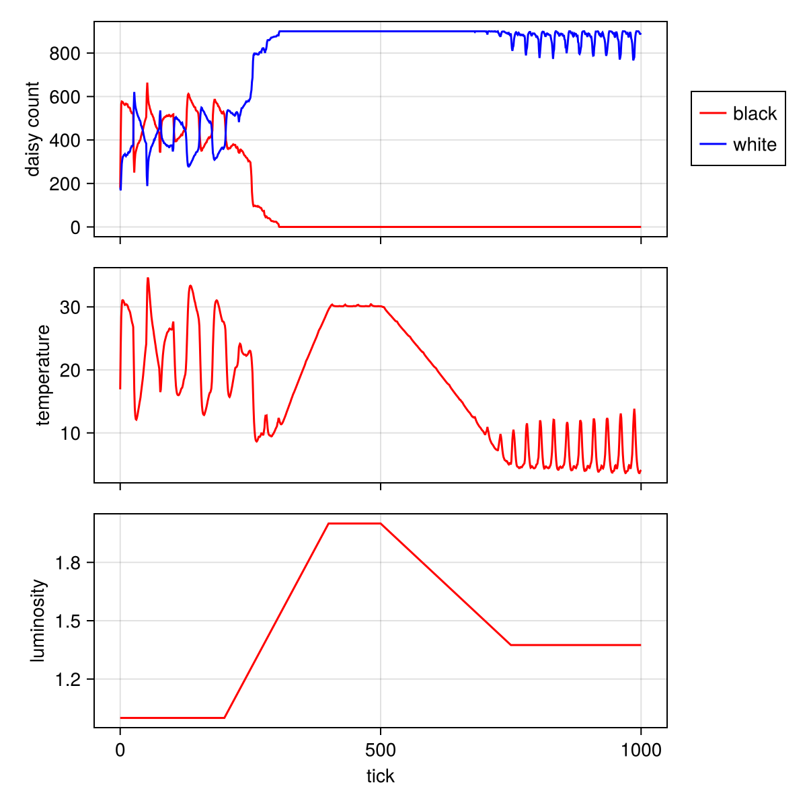{#fig-010 width=70%}

## Параметрическая реализация и визуализация

Для изучения модели полезно провести подбор параметров, после чего ознакомиться с различными результатами экспериментов. Для этого был создан скрипт daisyworld__param.jl. В результате работы программы было получено 12 графиков модели daisyworld - по три изображения на каждый вариант параметров: 

## Комбинация №1

Параметры: 

* albedo_black=0.25
* albedo_white=0.75
* init_black=0.2
* init_white=0.2
* max_age=25
* scenario=default
* seed=165
* solar_change=0.005
* solar_luminosity=1.0
* surface_albedo=0.4

## Комбинация №1 - Визуализация результатов

{#fig-011 width=70%}

## Комбинация №1 - Визуализация результатов

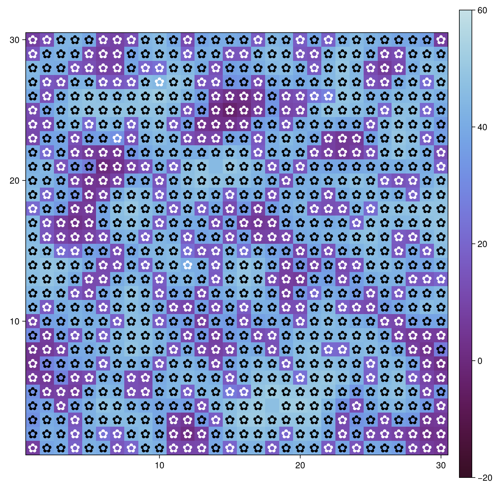{#fig-012 width=70%}

## Комбинация №1 - Визуализация результатов

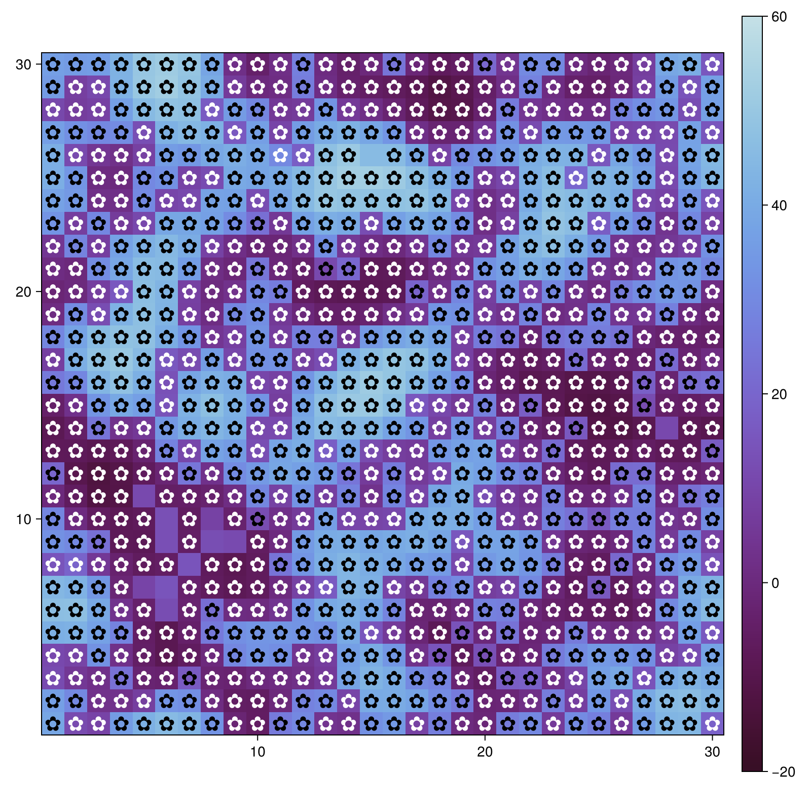{#fig-013 width=70%}

## Комбинация №2

Параметры:

* albedo_black=0.25 
* albedo_white=0.75 
* init_black=0.2
* init_white=0.2
* max_age=40 - Максимальный возраст маргаритки повышен до 40
* scenario=default
* seed=165
* solar_change=0.005
* solar_luminosity=1.0
* surface_albedo=0.4

## Комбинация №2 - Визуализация результатов

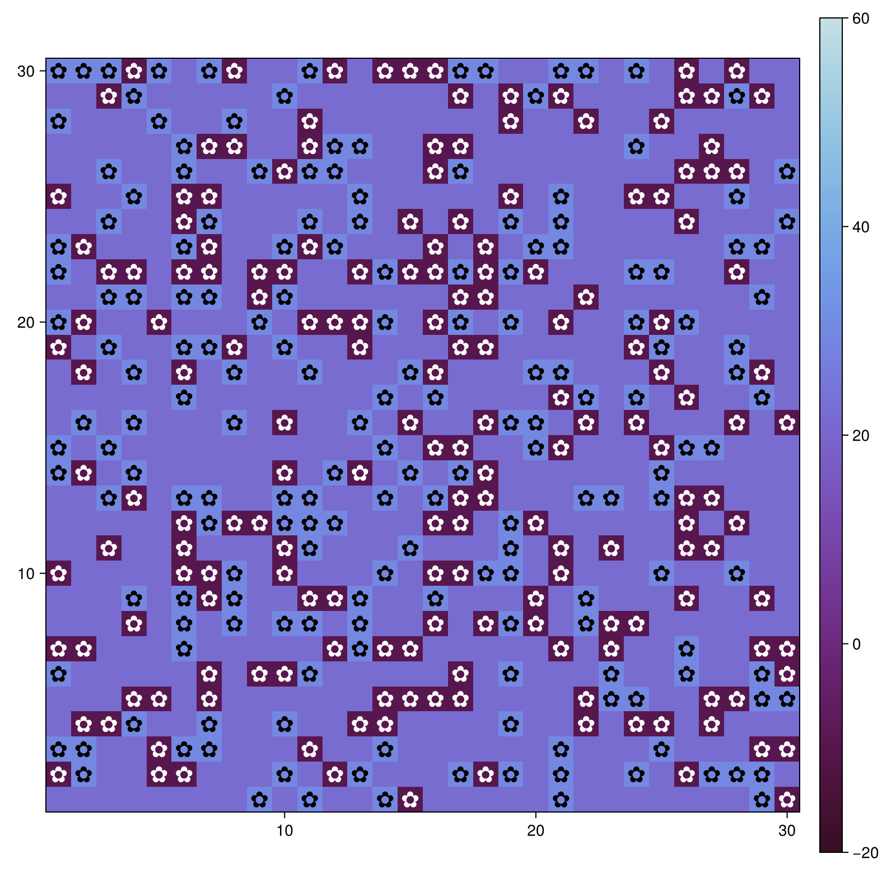{#fig-014 width=70%}

## Комбинация №2 - Визуализация результатов

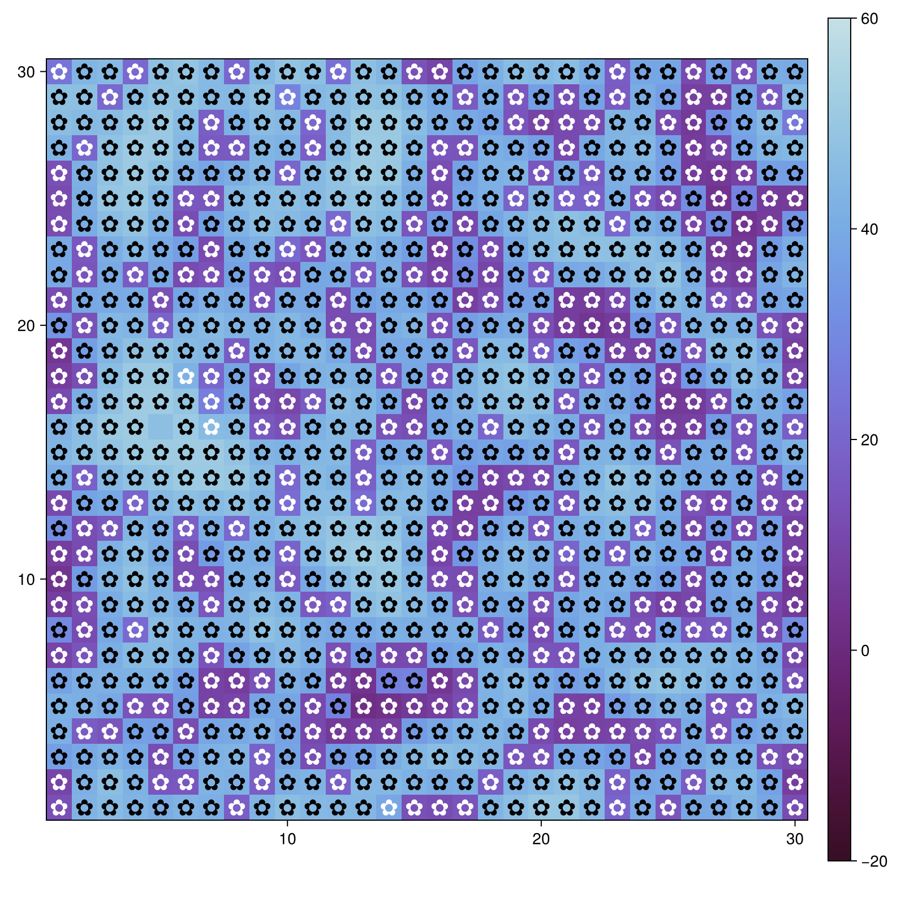{#fig-015 width=70%}

## Комбинация №2 - Визуализация результатов

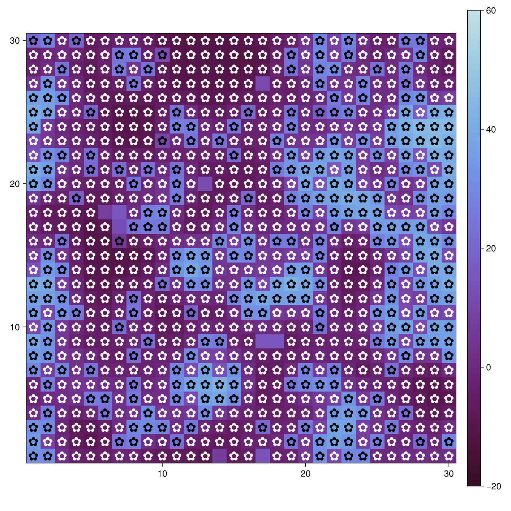{#fig-016 width=70%}

## Комбинация №3

Параметры:

* albedo_black=0.25 
* albedo_white=0.75 
* init_black=0.2
* init_white=0.8 - Повышено с 0.2 до 0.8
* max_age=25 - Максимальный возраст маргаритки: 25
* scenario=default
* seed=165
* solar_change=0.005
* solar_luminosity=1.0
* surface_albedo=0.4

## Комбинация №3 - Визуализация результатов

{#fig-017 width=70%}

## Комбинация №3 - Визуализация результатов

{#fig-018 width=70%}

## Комбинация №3 - Визуализация результатов

{#fig-019 width=70%}

## Комбинация №4

Параметры:

* albedo_black=0.25 
* albedo_white=0.75 
* init_black=0.2
* init_white=0.8 - Повышено с 0.2 до 0.8
* max_age=40 - Максимальный возраст маргаритки повышен до 40
* scenario=default
* seed=165
* solar_change=0.005
* solar_luminosity=1.0
* surface_albedo=0.4

## Комбинация №4 - Визуализация результатов

{#fig-020 width=70%}

## Комбинация №4 - Визуализация результатов

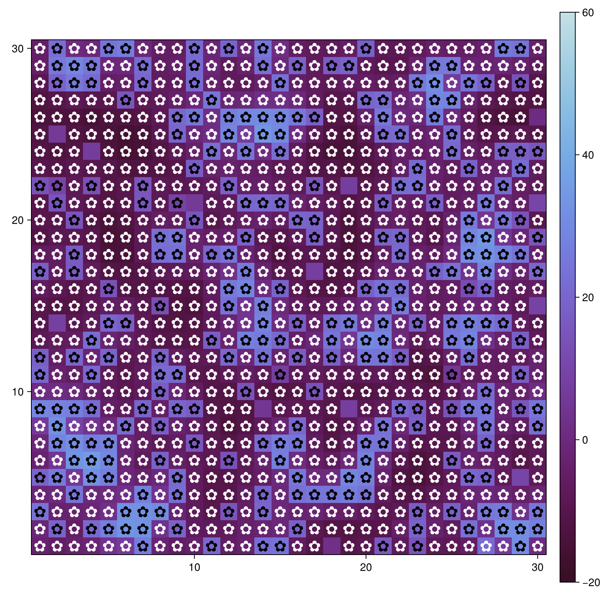{#fig-021 width=70%}

## Комбинация №4 - Визуализация результатов

{#fig-022 width=70%}

## Параметрическая реализация - Динамика числа маргариток

Для анализа влияния параметров на количество маргариток был создан скрипт daisyworld-count__param.jl. В результате были получены следующие графики: 

## Набор параметров 1:

Параметры: 

* albedo_black=0.25
* albedo_white=0.75
* init_black=0.2
* init_white=0.2
* max_age=25
* scenario=default
* seed=165
* solar_change=0.005
* solar_luminosity=1.0
* surface_albedo=0.4

## Комбинация №1 - Визуализация

{#fig-023 width=70%}

## Набор параметров 2: 

Параметры:

* albedo_black=0.25 
* albedo_white=0.75 
* init_black=0.2
* init_white=0.2
* max_age=40 - Максимальный возраст маргаритки повышен до 40
* scenario=default
* seed=165
* solar_change=0.005
* solar_luminosity=1.0
* surface_albedo=0.4

## Комбинация №2 - Визуализация

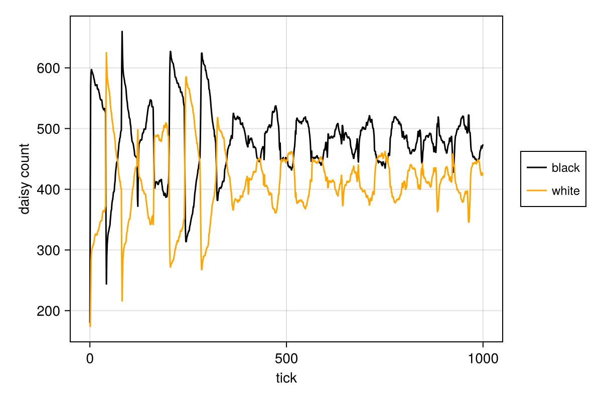{#fig-024 width=70%}

## Набор параметров 3:

Параметры:

* albedo_black=0.25 
* albedo_white=0.75 
* init_black=0.2
* init_white=0.8 - Повышено с 0.2 до 0.8
* max_age=25 - Максимальный возраст маргаритки: 25
* scenario=default
* seed=165
* solar_change=0.005
* solar_luminosity=1.0
* surface_albedo=0.4

## Комбинация №3 - Визуализация

{#fig-025 width=70%}

## Набор параметров 4:

Параметры:

* albedo_black=0.25 
* albedo_white=0.75 
* init_black=0.2
* init_white=0.8 - Повышено с 0.2 до 0.8
* max_age=40 - Максимальный возраст маргаритки повышен до 40
* scenario=default
* seed=165
* solar_change=0.005
* solar_luminosity=1.0
* surface_albedo=0.4

## Комбинация №4 - Визуализация

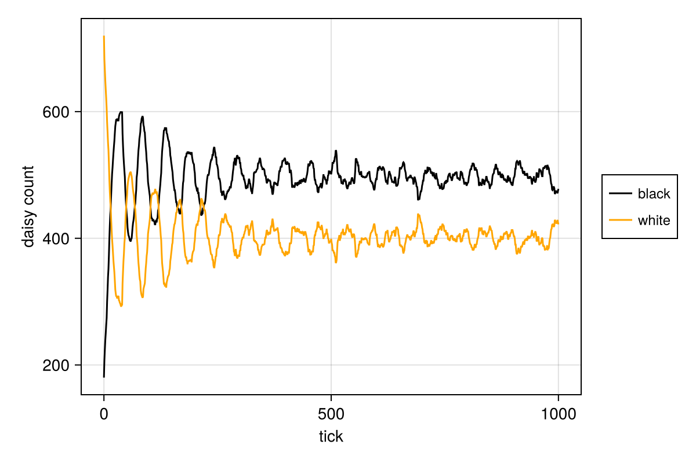{#fig-026 width=70%}

## Параметрическая реализация - Динамика температуры, альбедо, числа маргариток

Для анализа влияния параметров на температуру, альбедо, число маргариток был создан скрипт daisyworld-luminosity__param.jl. В результате были получены следующие графики: 

## Набор параметров 1:

Параметры:

* albedo_black=0.25
* albedo_white=0.75
* init_black=0.2
* init_white=0.2
* max_age=25
* scenario=default
* seed=165
* solar_change=0.005
* solar_luminosity=1.0
* surface_albedo=0.4

## Комбинация №1 - Визуализация

{#fig-027 width=70%}

## Набор параметров 2: 

Параметры:

* albedo_black=0.25 
* albedo_white=0.75 
* init_black=0.2
* init_white=0.2
* max_age=40 - Максимальный возраст маргаритки повышен до 40
* scenario=default
* seed=165
* solar_change=0.005
* solar_luminosity=1.0
* surface_albedo=0.4

## Комбинация №2 - Визуализация

{#fig-028 width=70%}

## Набор параметров 3: 

Параметры:

* albedo_black=0.25 
* albedo_white=0.75 
* init_black=0.2
* init_white=0.8 - Повышено с 0.2 до 0.8
* max_age=25 - Максимальный возраст маргаритки: 25
* scenario=default
* seed=165
* solar_change=0.005
* solar_luminosity=1.0
* surface_albedo=0.4

## Комбинация №3 - Визуализация

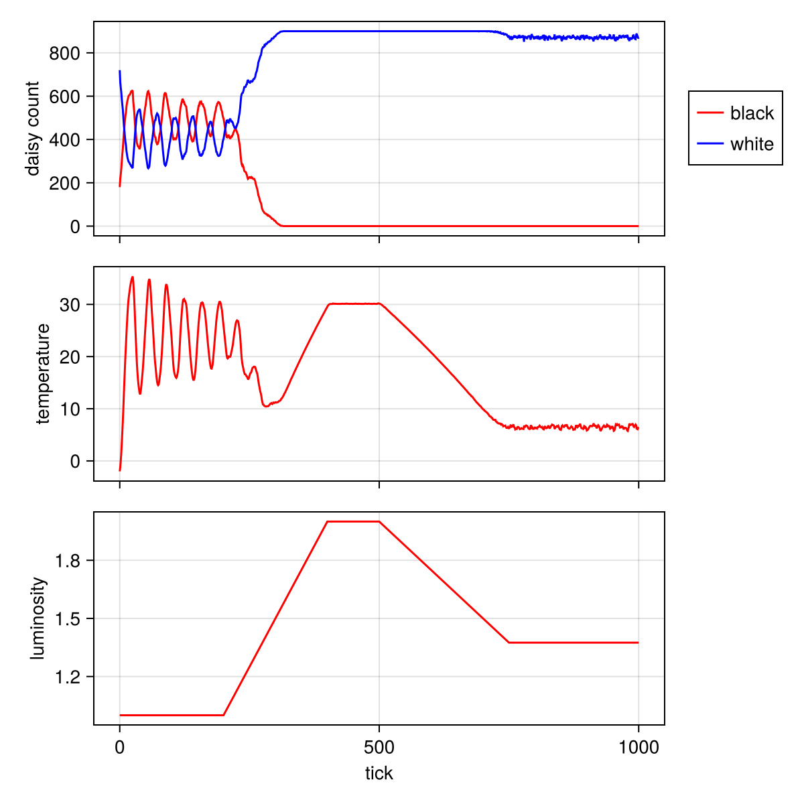{#fig-029 width=70%}

## Набор параметров 4: 

Параметры:

* albedo_black=0.25 
* albedo_white=0.75 
* init_black=0.2
* init_white=0.8 - Повышено с 0.2 до 0.8
* max_age=40 - Максимальный возраст маргаритки повышен до 40
* scenario=default
* seed=165
* solar_change=0.005
* solar_luminosity=1.0
* surface_albedo=0.4

## Комбинация №4 - Визуализация

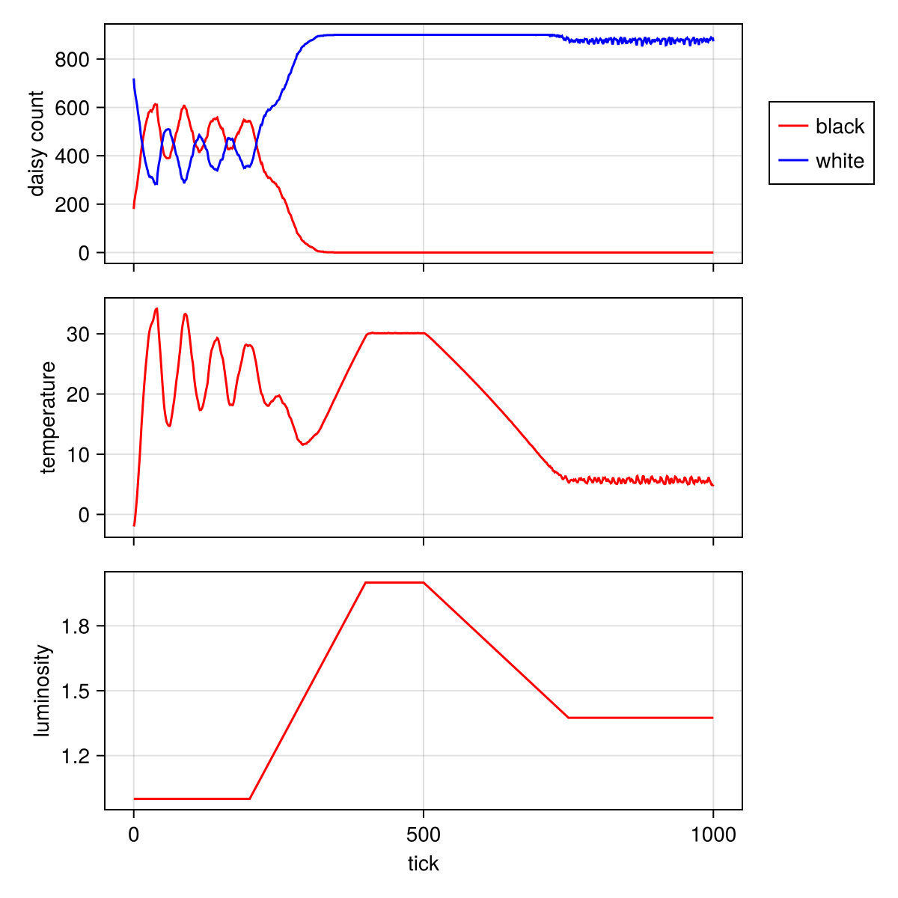{#fig-030 width=70%}

## Результаты анализа

В результате анализа влияния параметров можно сделать следующие выводы:

* Повышение возраста маргаритки заставило температуру меньше варьироваться на ранних шагах модели
* Повышение исключительно параметра init_white привело к более предсказуемой вариации температуры среды на ранних шагах модели - неоднократно были достигнуты практически одинаковые пики температуры
* Повышение возраста маргаритки вместе с параметром init_white также заставило температуру варьироваться гораздо меньше

Однако, общая картинка по всем параметрам была схожа. Основные изменения происходили на ранних шагах модели.

# Выводы

В результате выполнения данной лабораторной работы я изучил агентный подход имитационного моделирования на примере модели Daisyworld, реализованной на Julia. Разобрался в самой модели и интегрировал её реализацию в данный отчёт.

## Список литературы

[Лабораторная работа №3](https://esystem.rudn.ru/mod/resource/view.php?id=1356134)
