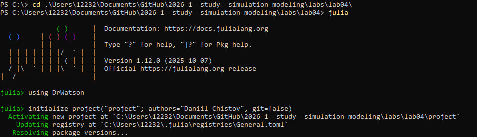
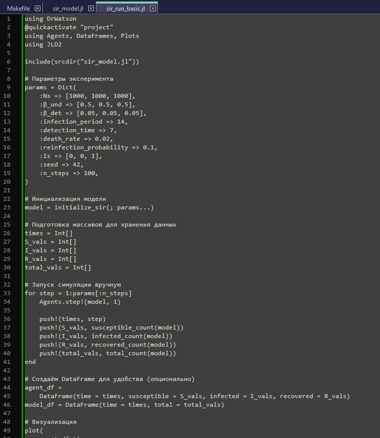
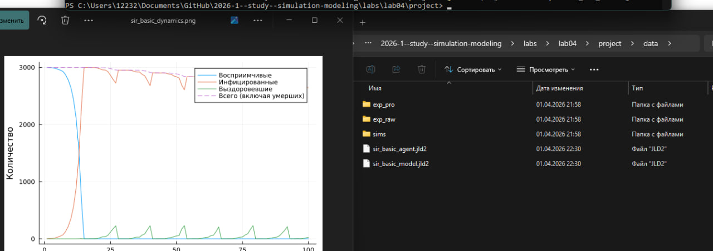
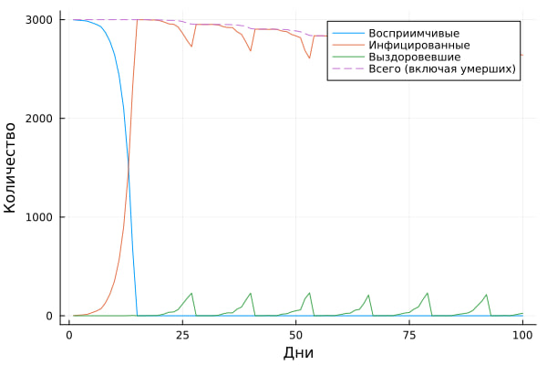
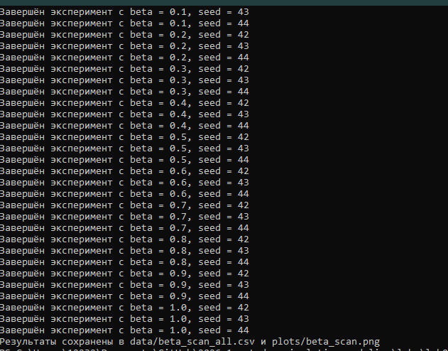
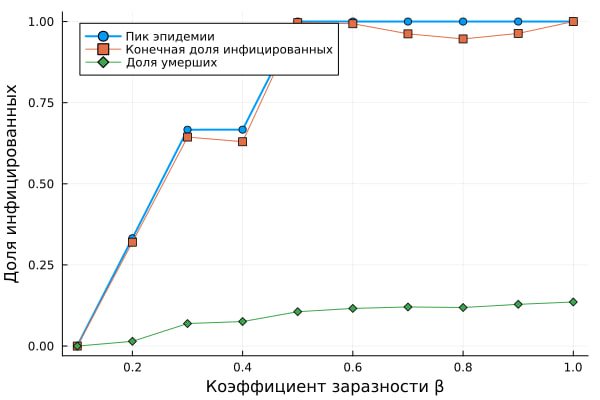
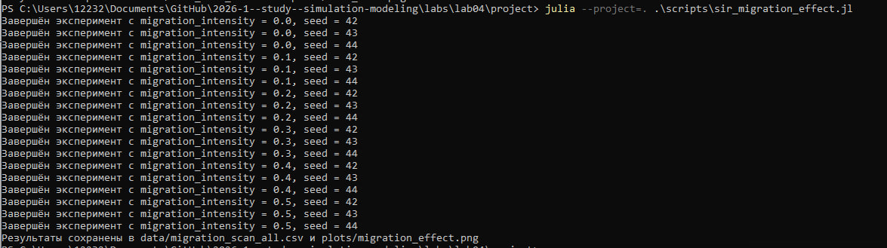
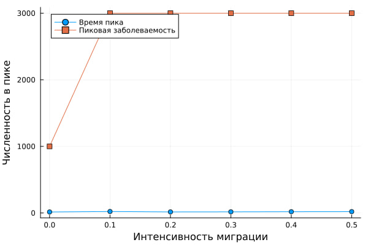
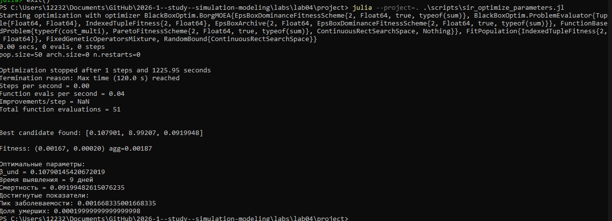

---
## Author
author:
  name: Чистов Даниил Максимович
  degrees: DSc
  orcid: 0000-0002-0877-7063
  email: 1132236021@rudn.ru
  affiliation:
    - name: Российский университет дружбы народов
      country: Российская Федерация
      postal-code: 117198
      city: Москва
      address: ул. Миклухо-Маклая, д. 6

## Title
title: "Лабораторная работа №4"
subtitle: "Математическое моделирование"
license: "CC BY"
---

```{julia}
import Pkg
Pkg.activate("../project")
Pkg.instantiate()
```

# Цель работы

Целью данной работы ознакомление с моделью гармонических колебаний и решение нескольких задач.

# Задание

1. Построить решение уравнения гармонического осциллятора без затухания
2. Записать уравнение свободных колебаний гармонического осциллятора с затуханием, построить его решение. Построить фазовый портрет гармонических колебаний с затуханием.
3. Записать уравнение колебаний гармонического осциллятора, если на систему действует внешняя сила, построить его решение. Построить фазовый портрет колебаний с действием внешней силы.
4. Ответить на вопросы к лабораторной работе

# О модели гармонических колебаний

Движение грузика на пружинке, маятника, заряда в электрическом контуре, а также эволюция во времени многих систем в физике, химии, биологии и других науках при определенных предположениях можно описать одним и тем же дифференциальным уравнением, которое в теории колебаний выступает в качестве основной модели. Эта модель называется линейным гармоническим осциллятором.

Независимые переменные x, y определяют пространство, в котором «движется» решение. Это фазовое пространство системы, поскольку оно двумерно будем называть его фазовой плоскостью. Значение фазовых координат x, y в любой момент времени полностью определяет состояние системы. Решению уравнения движения как функции времени отвечает гладкая кривая в фазовой плоскости. Она называется фазовой траекторией. Если множество различных решений (соответствующих различным начальным условиям) изобразить на одной фазовой плоскости, возникает общая картина поведения системы. Такую картину, образованную набором фазовых траекторий, называют фазовым портретом.

# Выполнение лабораторной работы

В папке lab04 инициализирую проект для данной лабораторной работы ([рис. @fig-001])

{#fig-001 width=70%}


### Базовая экспериент

Создаю файл sir_run_basic.jl в папке /scripts. Это базовый эксперимент ([рис. @fig-002]).

{#fig-002 width=70%}


Код успешно работает - результаты расположены в соответствующих папках ([рис. @fig-003]).

{#fig-003 width=70%}

Ниже представлен график базового эксперимента ([рис. @fig-004]).

{#fig-004 width=70%}

### Дополнительное задание №1

Требуется определить базовое репродуктивное число R₀ по формуле R₀ = β/γ, где γ = 1/infection_period. Затем сравнить с наблюдаемой динамикой.

Требуемые для решения задачи параметры можно найти в коде:

* β_und => [0.5, 0.5, 0.5], т. е. всегда 0.5
* infection_period => 14

Тогда $R_{0} = (0.5) * 14 = 7$

Так как базовое репродуктивное число значительно больше 1, следует ожидать быстрой рост. Это соответствует полученному результату на графике

### Сканирование коэффициента заразности

По заданию требуется создать код sir_scan_beta.jl. 

Данный код исследует, как изменение базовой заразности (β_und и пропорционально β_det) влияет на эпидемические показатели: пик заболеваемости, долю переболевших, число умерших. Выполняется параметрическое сканирование с несколькими повторными прогонами для учёта стохастичности.


Код успешно работает ([рис. @fig-005]).

{#fig-005 width=70%}

Ниже представлен график, полученный в результате работы кода ([рис. @fig-006]).

{#fig-006 width=70%}

### Дополнительное задание №2

Требуется:

* Найти минимальное значение $\beta$, при котором возникает эпидемия (пик I > 5% популяции).
* Сравнить с теоретическим порогом $R_{0} = 1$.

Из кода sir_scan_beta.jl известен размер популяции: Ns => [1000, 1000, 1000]. Следовательно вся популяция вместе N = 3000, а значит нужно найти такое значение $\beta$, при котором возникает эпидемия (пик I > 150 популяции).

По графику можно сделать вывод, что эпидемия возникнет при $\beta$ значительно меньше 0.2.

Код успешно работает ([рис. @fig-007]).

{#fig-007 width=70%}

Ниже представлен график, полученный в результате работы кода ([рис. @fig-008]).

{#fig-008 width=70%}

### Многокритериальная оптимизация параметров

По заданию был создан код, который ищет оптимальные комбинации параметров, минимизирующие одновременно два критерия: пиковую заболеваемость и долю умерших.


Код успешно работает и приводит следующие результаты в терминале ([рис. @fig-009]).

{#fig-009 width=70%}

### Сводная визуализация результатов

Для выполнения работы также требуется создать код, который загружает результаты параметрического сканирования (файл data/beta_scan_all.csv, созданный scan_beta.jl) и строит единый составной график, объединяющий три панели:

* пик эпидемии и конечная доля инфицированных;
* число умерших;
* доля выздоровевших.

Ниже его реализация: sir_visualize_dynamic.jl


Код успешно работает. В результате был получен следующий график ([рис. @fig-010]).


# Выводы

В результате выполнения данной лабораторной работы я закрепил навыки работы с агентным подходом имитационного моделирования на примере модели SIR, реализованной на Julia. Разобрался в самой модели и интегрировал её реализацию в данный отчёт.
