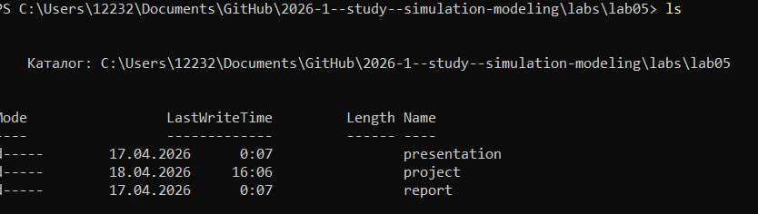
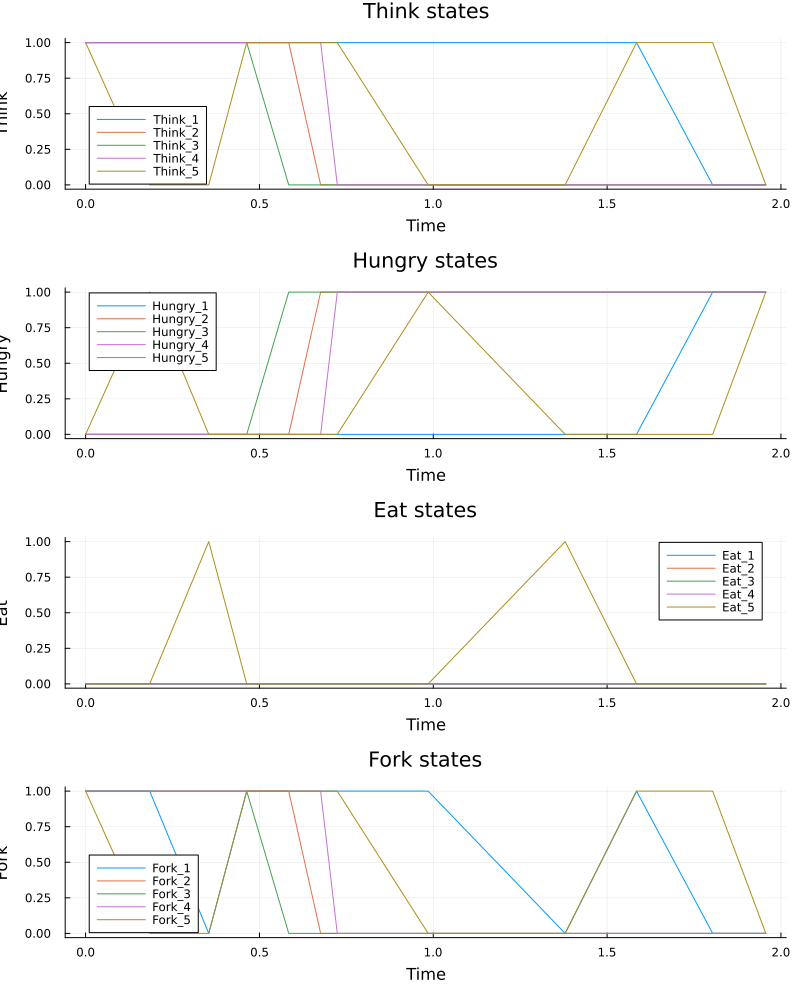
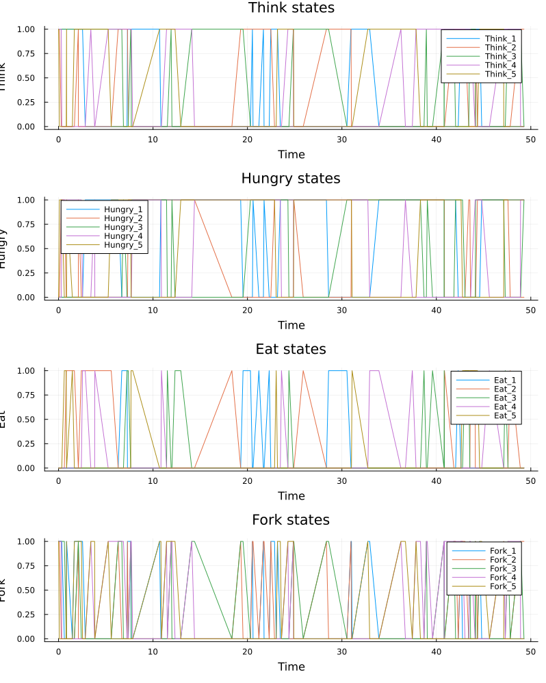

---
## Author
author:
  name: Чистов Даниил Максимович
  degrees: DSc
  orcid: 0000-0002-0877-7063
  email: 1132236021@rudn.ru
  affiliation:
    - name: Российский университет дружбы народов
      country: Российская Федерация
      postal-code: 117198
      city: Москва
      address: ул. Миклухо-Маклая, д. 6

## Title
title: "Лабораторная работа №5"
subtitle: "Математическое моделирование"
license: "CC BY"
---

```{julia}
import Pkg
Pkg.activate("../project")
Pkg.instantiate()
```

# Цель работы

Целью данной работы ознакомление с моделью "Хищник жертва" и решение задачи.


## Общая информация

Простейшая модель взаимодействия двух видов типа «хищник — жертва» - модель Лотки-Вольтерры. Данная двувидовая модель основывается на следующих предположениях:

1. Численность популяции жертв x и хищников y зависят только от времени (модель не учитывает пространственное распределение популяции на занимаемой территории)
2. В отсутствии взаимодействия численность видов изменяется по модели Мальтуса, при этом число жертв увеличивается, а число хищников падает 3. Естественная смертность жертвы и естественная рождаемость хищника считаются несущественными
4. Эффект насыщения численности обеих популяций не учитывается
5. Скорость роста численности жертв уменьшается пропорционально численности хищников

В этой модели x – число жертв, y - число хищников. Коэффициент a описывает скорость естественного прироста числа жертв в отсутствие хищников, с - естественное вымирание хищников, лишенных пищи в виде жертв. Вероятность взаимодействия жертвы и хищника считается пропорциональной как количеству жертв, так и числу самих хищников (xy). Каждый акт взаимодействия уменьшает популяцию жертв, но способствует увеличению популяции хищников (члены -bxy и dxy в правой части уравнения).

## Задача

В лесу проживают х число волков, питающихся зайцами, число которых в этом же лесу у. Пока число зайцев достаточно велико, для прокормки всех волков, численность волков растет до тех пор, пока не наступит момент, что корма перестанет хватать на всех. Тогда волки начнут умирать, и их численность будет уменьшаться. В этом случае в какой-то момент времени численность зайцев снова начнет увеличиваться, что повлечет за собой новый рост популяции волков. Такой цикл будет повторяться, пока обе популяции будут существовать. Помимо этого, на численность стаи влияют болезни и старение. 

1. Построить график зависимостиx отy и графики функций( ), ( )x t y t
2. Найти стационарное состояние системы


В папке lab05 инициализирую проект для данной лабораторной работы ([рис. @fig-001])

{#fig-001 width=70%}

В папке /src создаю файл DiningPhilosophers.jl. Это код модели задачи обедающих философов, который будет использоваться другими скриптами ([рис. @fig-002])

{#fig-002 width=70%}

Ниже представлен код данной модели:

В папке /scripts создаю файл dining_philosophers.jl ([рис. @fig-003]).

{#fig-003 width=70%}

Скрипт выполняет основное моделирование и сравнение двух вариантов сети Петри:

* классическая модель (без арбитра), в которой возможна взаимная блокировка (deadlock);
* модифицированная модель с арбитром, которая должна предотвращать deadlock.

Классическая сеть должна приводить к deadlock (через некоторое время все философы оказываются в состоянии Hungry, ни один не может есть). Если detect_deadlock возвращает true, это подтверждает теоретический вывод: классическая постановка задачи обедающих философов ведёт к взаимной блокировке.

Сеть с арбитром (дополнительная позиция с N-1 фишками) должна избегать deadlock: detect_deadlock возвращает false. Это демонстрирует один из способов синхронизации для предотвращения тупиков.

Ниже приведён код dining_philosophers.jl:

Данный код: 
* Создаёт классическую сеть Петри для N=5 философов с помощью build_classical_network.
* Запускает стохастическую симуляцию (алгоритм Гиллеспи) на время tmax = 50.0.
* Сохраняет полную историю маркировок в CSV-файл (dining_classic.csv).
* Анализирует последнее состояние на предмет deadlock с помощью detect_deadlock и выводит результат в консоль.
* Строит графики эволюции маркировки по всем позициям (Think, Hungry, Eat, Fork) и сохраняет их как classic_simulation.png.
* Повторяет шаги 1–5 для сети с арбитром (build_arbiter_network), сохраняя результаты в dining_arbiter.csv и arbiter_simulation.png

Код успешно работает ([рис. @fig-004]).

{#fig-004 width=70%}

В результате работы скрипта были получены следующие графики:

* Резлуьтат работы классической модели ([рис. @fig-005]).
* Резлуьтат работы модели с арбитром ([рис. @fig-006]).

{#fig-005 width=70%}

{#fig-006 width=70%}

Графики эволюции маркировки позволяют визуально увидеть, как меняются состояния.

* В классической сети рано или поздно все Eat_i становятся нулевыми, а Hungry_i – единичными (или наоборот).
* В сети с арбитром наблюдается постоянное чередование приёма пищи

Для наглядной демонстрации динамики работы сети Петри во времени создадим скрипт dining_philosophers_animation.jl. 

Данный скрипт: 
* Берёт классическую сеть (для малого числа философов (N=3) для упрощения визуализации).
* Запускает стохастическую симуляцию на tmax = 30.0.
* Создаёт анимацию с помощью макроса @animate, где каждый кадр – это столбчатая диаграмма текущей маркировки (количество фишек в каждой позиции).
* Сохраняет анимацию как GIF-файл philosophers_simulation.gif с частотой 5 кадров в секунду.

С результатом работы скрипта вы можете ознакомиться в папке lab05/report/images или lab05/project/plots - там находится файл анимации philosophers_simulation.gif.

Для сравнительного анализа двух моделей требуется создать скрипт dining_philosophers_report.jl, который будет загружать ранее сохранённые CSV-файлы (dining_classic.csv и dining_arbiter.csv) из папки data/, извлекать столбцы, соответствующие состоянию Eat_i для каждого философа, строить два временных графика (один под другим): динамику «едящих» философов для классической сети и для сети с арбитром, затем сохранять объединённый график как final_report.png в папку plots/.

В результате был получен следующий график ([рис. @fig-007]).

{#fig-007 width=70%}

Изучив график, можно сделать следующие выводы: 

* На графике классической сети видно, что через некоторое время все линии Eat_i падают до нуля и остаются на нуле - это и есть deadlock, философы больше не могут есть.
* На графике сети с арбитром линии Eat_i колеблются, всегда есть хотя бы один философ, который ест (или они поочерёдно получают доступ).
* Отсутствие длительных нулевых периодов подтверждает, что система жива и не блокируется. 

По данному графику можно сделать вывод, что введение арбитра является эффективным решением пробелмы deadlock

# Выводы

В результате выполнения данной лабораторной работы я изучил сети Петри и поработал с задачей "Обедающие философы", решив проблему deadlock путём введения арбитра.
