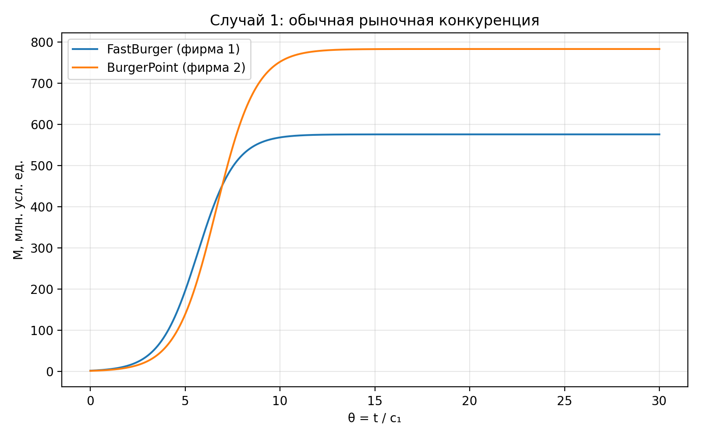
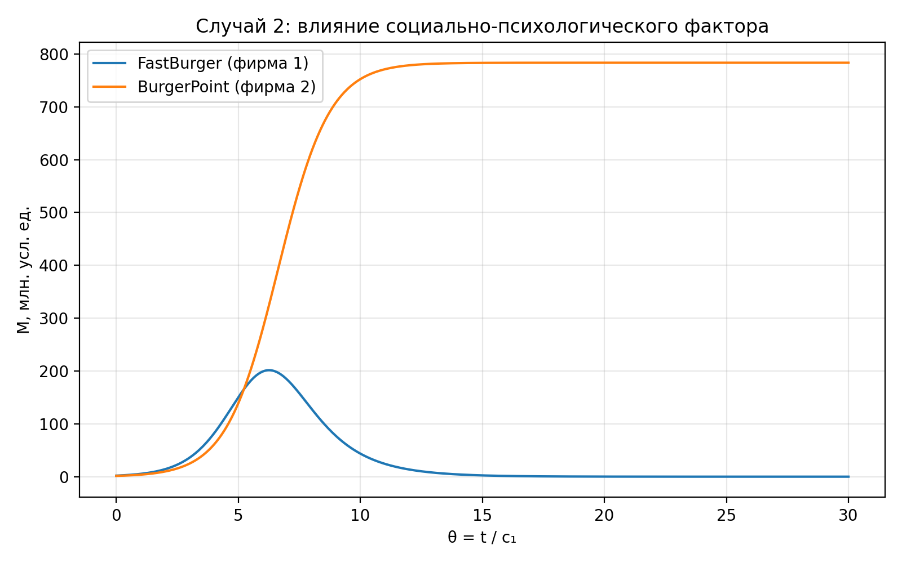

---
## Author
author:
  name: Чистов Даниил Максимович
  email: 1132236021@rudn.ru
  affiliation:
    - name: Российский университет дружбы народов
      country: Российская Федерация
      postal-code: 117198
      city: Москва
      address: ул. Миклухо-Маклая, д. 6

## Title
title: "Лабораторная работа №8"
subtitle: "Модель конкуренции двух фирм"
license: "CC BY"
---

# Цель работы

Целью данной лабораторной работы является изучение модели конкуренции двух фирм, построение динамики изменения оборотных средств конкурирующих компаний, анализ двух случаев конкурентного взаимодействия и нахождение стационарного состояния системы для первого случая.

# Задания

1. Придумать свой пример двух конкурирующих фирм с идентичным товаром. Задать начальные значения и известные составляющие. Построить графики изменения объемов оборотных средств каждой фирмы. Рассмотреть два случая.
2. Проанализировать полученные результаты.
3. Найти стационарное состояние системы для первого случая

# Выполнение работы

## Постановка задачи

В качестве примера двух конкурирующих фирм было придумано две сети фастфуда, которые работают в одной рыночной нише и предлагают взаимозаменяемый товар. Первая сеть называется FastBurger, вторая сеть называется BurgerPoint. Предполагается, что обе сети продают похожий продукт, например бургеры или комбо-обеды, поэтому потребители могут выбирать между ними без существенной разницы в качестве товара.

## Постановка задачи

Для выполнения работы необходимо рассмотреть два случая:

* обычная рыночная конкуренция, при которой фирмы конкурируют за счёт экономических параметров;
* конкуренция с дополнительным социально-психологическим фактором, при котором одна фирма получает преимущество за счёт бренда, рекламы или лояльности потребителей.

## Параметры модели

С кодом модели можно ознакомиться в отчёте

Для собственного примера были выбраны следующие параметры:

* `p_cr = 25` — критическая цена товара;
* `tau1 = 8` — длительность производственного цикла первой фирмы;
* `tau2 = 12` — длительность производственного цикла второй фирмы;
* `p1 = 10` — себестоимость товара первой фирмы;
* `p2 = 8` — себестоимость товара второй фирмы;
* `N = 12` — число потенциальных потребителей, тыс.;
* `q = 1` — максимальная потребность одного потребителя в продукте;
* `M10 = 2.0` — начальные оборотные средства первой фирмы, млн. усл. ед.;
* `M20 = 1.5` — начальные оборотные средства второй фирмы, млн. усл. ед.

## Параметры модели

Первая сеть фастфуда имеет более короткий цикл оборота, то есть быстрее масштабируется. При этом её себестоимость выше. Вторая сеть работает медленнее, но имеет меньшую себестоимость продукта.

## Случай 1. Обычная рыночная конкуренция

В первом случае предполагается, что фирмы конкурируют только экономическими методами. Это означает, что каждая сеть влияет на рынок через длительность производственного цикла, себестоимость и объём оборотных средств. Дополнительного преимущества за счёт рекламы, узнаваемости бренда или лояльности потребителей не учитывается.

## Случай 1. Обычная рыночная конкуренция

В результате был получен следующий график ([рис. @fig-case-1]).

{#fig-case-1 width=70%}

## Случай 1. Обычная рыночная конкуренция

По графику видно, что обе сети фастфуда остаются на рынке. Оборотные средства FastBurger быстро растут и выходят на устойчивый уровень. BurgerPoint также увеличивает оборотные средства и достигает более высокого стационарного уровня. Это объясняется тем, что вторая сеть имеет меньшую себестоимость товара, хотя её производственный цикл длиннее.

Таким образом, в первом случае рынок фактически делится между двумя конкурентами. Ни одна из фирм не вытесняет другую полностью.

## Нахождение стационарного состояния для первого случая

Для первого случая стационарное состояние находится из условий:

```julia
# Стационарное состояние первого случая
A = [a1 / c1  b / c1;
     b / c1   a2 / c1]
rhs = [1.0, c2 / c1]
M_star = A \ rhs
```

## Нахождение стационарного состояния для первого случая

После подстановки выбранных параметров получаем:

* `M1* ≈ 575.92` млн. усл. ед.;
* `M2* ≈ 783.27` млн. усл. ед.

## Нахождение стационарного состояния для первого случая

Следовательно, устойчивое состояние рынка в первом случае соответствует тому, что FastBurger занимает меньшую часть рынка, а BurgerPoint — большую. Это связано с преимуществом второй фирмы по себестоимости продукта.

## Случай 2. Конкуренция с социально-психологическим фактором

Во втором случае в модель добавляется дополнительное влияние на первую фирму. Его можно интерпретировать как усиление общественного предпочтения в пользу второй сети. Например, BurgerPoint может активнее развивать бренд, использовать рекламу, программу лояльности или формировать более устойчивую привязанность потребителей.

В модели это отражается дополнительным коэффициентом `0.002` в первом уравнении. Он усиливает отрицательное влияние второй фирмы на оборотные средства первой фирмы.

## Случай 2. Конкуренция с социально-психологическим фактором

В результате был получен следующий график ([рис. @fig-case-2]).

{#fig-case-2 width=70%}

## Случай 2. Конкуренция с социально-психологическим фактором

По графику видно, что FastBurger сначала демонстрирует рост, однако затем его оборотные средства начинают снижаться. В итоге первая фирма фактически теряет возможность устойчиво работать на рынке. BurgerPoint, наоборот, продолжает рост и выходит на высокий устойчивый уровень.

Это показывает, что даже при наличии начального роста фирма может проиграть конкурентную борьбу, если в модели появляется дополнительный фактор общественного предпочтения в пользу конкурента.

## Сравнение двух случаев

В первом случае конкуренция приводит к разделению рынка между двумя сетями фастфуда. Обе фирмы сохраняют положительные оборотные средства и достигают устойчивого состояния. Во втором случае дополнительный социально-психологический фактор меняет динамику: одна фирма получает преимущество, а другая постепенно вытесняется с рынка.

Таким образом, модель показывает, что экономические параметры важны, однако в конкурентной борьбе значимую роль могут играть и неэкономические факторы: узнаваемость бренда, реклама, доверие потребителей и сформированное общественное предпочтение.

# Выводы

В результате выполнения лабораторной работы была рассмотрена модель конкуренции двух фирм на примере двух сетей фастфуда. Были заданы собственные параметры модели и построены графики динамики оборотных средств для двух случаев.

В первом случае обе фирмы смогли остаться на рынке и достичь стационарного состояния. Для этого случая было найдено стационарное состояние системы: `M1* ≈ 575.92`, `M2* ≈ 783.27`. Во втором случае добавление социально-психологического фактора привело к вытеснению первой фирмы с рынка.

Можно сделать вывод, что модель позволяет качественно исследовать конкурентное взаимодействие фирм и показывает, как изменение факторов влияния может приводить к разным сценариям развития рынка.

# Список литературы

[Лабораторная работа №8](https://esystem.rudn.ru/pluginfile.php/3094766/mod_resource/content/2/%D0%9B%D0%B0%D0%B1%D0%BE%D1%80%D0%B0%D1%82%D0%BE%D1%80%D0%BD%D0%B0%D1%8F%20%D1%80%D0%B0%D0%B1%D0%BE%D1%82%D0%B0%20%E2%84%96%207.pdf)
